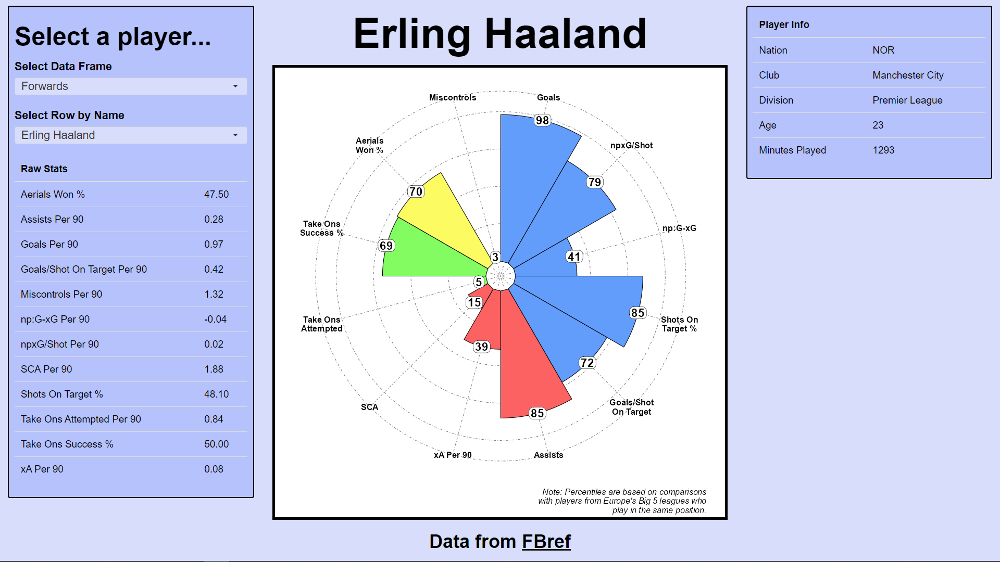

::: {.callout-caution}
The code used for web scraping in this project no longer functions due to changes with Fbref's page structure and bot-detection. 

See Sports Reference's [terms of use](https://www.sports-reference.com/termsofuse.html) and [bot traffic](https://www.sports-reference.com/bot-traffic.html) pages for more information.
:::

# What are Percentile Radars?

A *percentile radar* is a type of data visualisation which represents a given subject (i.e. a participant, a football player, a whole country etc.) and their position in the overall sample distribution across a variety of different metrics.

This visualisation technique is commonly used in football, and other subject-matter, to provide a profile of a given player's performance, relative to their fellow professionals. From such visualisations, we can quickly see both what kind of player they are and where they rank.

Building an app which can pull together real-time player data and visualise it with percentile radars serves as a valuable tool for performance and recruitment analysis alike.

# Getting our Data: Web Scraping

Using data from [Fbref](https://fbref.com/en) and some R libraries, we are able to collect player data via web scraping.

Web scraping involves using the contents of a webpage's html code to identify relevant data and extract it for some purpose. In our case, we need player statistics for every male footballer in Europe's top-5 divisions.

The R libraries we will use are all from the [Tidyverse](https://tidyverse.org/) collection, specifically [rvest](https://rvest.tidyverse.org/index.html) for web scraping and [stringr](https://stringr.tidyverse.org/) for string manipulation.

```{r}
if (!require(tidyverse)) {
    install.packages("tidyverse", dependencies = TRUE); 
    require(tidyverse)    
}

if (!require(rvest)) {
    install.packages("rvest", dependencies = TRUE); 
    require(rvest)
}
```

To collect data from Fbref, we need to know which URLs contain the relevant data and thus to request html code from. At the time of me working on this project, player data is separated into categories (e.g. passing, shooting, defending, etc.) and kept on separate webpages. The *https://fbref.com/en/comps/Big5/Big-5-European-Leagues-Stats* URL contains hyperlinks to each of these separate webpages, so extracting these URLs will enable us to get access to the data.

```{r}
urls <- read_html(
      "https://fbref.com/en/comps/Big5/Big-5-European-Leagues-Stats"    
    ) %>% 
    # select all anchor nodes
    html_nodes("a") %>% 
    # grab the href attributes from those anchor nodes
    html_attr("href") %>%  
    # filter to urls we want, save as object
    str_subset(., "players/Big-5") %>% 
    # remove duplicates by using unique()
    unique() %>% 
    paste0("https://fbref.com", .)
```

The above R code grabs all the hyperlinks on the combined big-5 leagues webpage by first returning the html code from *https://fbref.com/en/comps/Big5/Big-5-European-Leagues-Stats*. We then select only the "anchor" nodes, which are the nodes used by html to store hyperlinks. 

Each anchor node has an "href" attribute which contains the raw URL. We can extract the URLs from all of these href attributes and filter down to only the URLs we want by taking the subset which match our search string *players/Big-5*. 

Any URLs containing this search string are kept, and the others discarded. We then construct the full URL paths by prepending the website domain *https://fbref.com* to each *players/Big-5* url and assigning these all to the *urls* object.

With these URLs, we can now begin extracting the table from each them. 

```{r}
# make an empty list for the tables to go in
tables <- list()

# loop through urls to extract tables
for (url in urls) {

    # each url contains a name that indicates what the table represents
    # extract the name from the url
    name <- url %>% str_extract_all("[^/]+") %>% flatten_chr() %>% nth(6)    

    # save each html table as "table"
    tables[[name]] <- read_html(url) %>%
        html_nodes("table") %>%
        html_table() %>% 
        lapply(as.data.frame)

    # print console message to show progress
    print(paste0("New table saved: ", name))

    # delete the temporary objects used in the function
    rm(url, name)

}
```

# Preparing our Data: Data Cleaning

Using our *tables* list, we can first separate out two of the tables which are only relevant to goalkeepers. Given their specialist role on the pitch, it doesn't make sense to have tables with goalkeepers and outfield players together.

```{r}
gk_tables <- tables[c(2,3)]    
tables <- tables[-c(2,3)]
```

The *tables* object still contains rows with goalkeepers, so we will filter them out.

```{r}
gk_tables_1 <- list() 

    # loop through each table in "tables"
    for (i in seq_along(tables)) {
    
        # grab rows where Pos == "GK", save to "table"
        table <- tables[[i]][tables[[i]]$Pos == "GK", ]
        
        # add "table" to the "gk_tables_1" list
        gk_tables_1[[names(tables)[i]]] <- table
        
        # remove rows where Pos == "GK" from original table
        tables[[i]] <- tables[[i]][tables[[i]]$Pos != "GK", ]    
        
        # delete temp objects
        rm(table, i)
    
    }
```

We have a table called *playingtime* which lists every player who has been named in a squad for at least 1 match in the season. This table has the most comprehensive list of players, but also includes players who have no recorded statistics at all (because they were simply named in a squad but didn't actually play). These players are referred to as "unused substitutes".

```{r}
# combine rows found in "playingtime" but not in "stats", compared by "Player", 
# and rows in "playingtime" where minutes played is NA, blank or 0.
unused_subs <- unique(bind_rows(
    anti_join(tables[["playingtime"]], tables[["stats"]], by = "Player"),
    filter(tables[["playingtime"]], is.na(Min) | Min == "" | Min == 0)
))

# remove unused subs from "playingtime" table
tables[["playingtime"]] <- anti_join(
    tables[["playingtime"]], unused_subs, by = "90s"
)

# repeat prior two steps for goalkeepers
unused_subs_gk <- unique(bind_rows(
    anti_join(gk_tables_1[["playingtime"]], gk_tables_1[["stats"]], by = "Player"),    
    filter(gk_tables_1[["playingtime"]], is.na(Min) | Min == "" | Min == 0)
))

gk_tables_1[["playingtime"]] <- anti_join(
    gk_tables_1[["playingtime"]], unused_subs_gk, by = "Min"
)    
```

We've now filtered out the unused subs from the goalkeepers and outfield players tables

We can now combine out outfield player tables into a single table, and similarly with the goalkeeper tables.

```{r}
# define first table from each list as the start point
final_table_outfield <- tables[["stats"]]
final_table_gks <- gk_tables[["keepers"]]

for (i in 2:length(tables)) {
        
    new_cols <- setdiff(colnames(tables[[i]]), colnames(final_table_outfield))    
    
    final_table_outfield <- cbind(final_table_outfield, tables[[i]][new_cols])
    
    rm(new_cols, i)

}
```

Whilst it might seem reasonable to assume each row now refers to a unique player, this is not the case. I decided to merge these rows together, reflecting that player's performance over the course of the season, whilst losing information about how they performed at each club. This aligns better with the aim of this project.

Below is an example of duplicate rows are merged together with the outfield players table, but the same process is applied to the outfield unused subs, goalkeepers and goalkeeper unused subs tables.

```{r}
# remove two-letter abbreviations from Nation and Comp columns
final_table_outfield$Nation <- str_remove(final_table_outfield$Nation, "^\\w+\\s")
final_table_outfield$Comp <- str_remove(final_table_outfield$Comp, "^\\w+\\s")

# group by Player, Age and Nation and combine rows together
final_table_outfield <- final_table_outfield %>%
    group_by(Player, Age, Nation) %>%
    summarise(
        # separate characters with commas
        across(where(is.character), ~paste(., collapse = ", ")),
        # simply add numeric values together
        across(where(is.numeric), sum)
    ) 

# Players cannot play more than 38 games in a season in the top 5 European divisions
final_table_outfield <- final_table_outfield %>% 
    filter(MP <= 38)

# remove duplicated character values after combining
final_table_outfield$Nation <- str_remove(final_table_outfield$Nation, "^[^,]+,\\s*")    
final_table_outfield$Pos <- str_remove(final_table_outfield$Pos, "^[^,]+,\\s*")
final_table_outfield$Age <- str_remove(final_table_outfield$Age, "^[^,]+,\\s*")
final_table_outfield$Born <- str_remove(final_table_outfield$Born, "^[^,]+,\\s*")

# remove duplicated character values but retain non-duplicated ones 
final_table_outfield$Comp <- sapply(final_table_outfield$Comp, function(x) {
    parts <- strsplit(x, ", ")[[1]]
    if (length(parts) > 1 && parts[1] == parts[2]) {
        parts[1]
    } else {
        x
    }
})

# reorder selected columns
final_table_outfield <- final_table_outfield %>% 
    relocate(id, Player, Pos, Nation, Squad, Comp, Age)

# make NAs 0
final_table_outfield[is.na(final_table_outfield)] <- 0

# convert age and born to numeric class
final_table_outfield[ , 7:ncol(final_table_outfield)] <- sapply(
    final_table_outfield[ , 7:ncol(final_table_outfield)], 
    as.numeric
)
```

# Building our Data: Percentiles

We can now begin calculating the data for our percentile radars. Firstly, we need to exclude players who have not played very many minutes. Scoring 1 goal and playing only 90 minutes compared to scoring 30 goals in 2,700 minutes both equate to 1 goal per 90 minutes, but clearly the player who has only played 90 minutes has not performed as impressively as the player who has played 2,700 minutes. 450 minutes, or 5 matches, is typically used as the threshold for excluding players. 

```{r}
final_table_outfield <- final_table_outfield %>%    
    filter(Min >= 450) %>% 
    as.data.frame() # object was not actually a data frame at this point

final_table_gks <- final_table_gks %>% 
    filter(Min >= 450)  %>% 
    as.data.frame() # object was not actually a data frame at this point
```

We now want to ensure all out statistics are converted to "per 90" statistics. 

```{r}
final_table_outfield_per90 <- final_table_outfield %>% 
    select(-contains("90"), -id, -Born, -MP, -Starts) %>% 
    mutate(Min_calc = Min) %>% 
    relocate(Min_calc) %>% 
    mutate(Min = as.character(Min)) %>% 
    mutate(across(where(is.numeric) & !contains(
        c(
        "%", "90", "Age", "_per_", "MatchesCompleted", 
        "MatchesStartedAsSub", "NotUsedSub"
        )
    ), ~(. / Min_calc) * 90)) %>% 
    select(-Min_calc) %>% 
    mutate(Min = as.numeric(Min))

final_table_gks_per90 <- final_table_gks %>% 
    select(-contains("90"), -id, -Born, -MP, -Starts) %>% 
    mutate(Min_calc = Min) %>% 
    relocate(Min_calc) %>% 
    mutate(Min = as.character(Min)) %>% 
    mutate(across(where(is.numeric) & !contains(
        c(
        "%", "90", "Age", "_per_", "MatchesCompleted", 
        "MatchesStartedAsSub", "NotUsedSub"
        )
    ), ~(. / Min_calc) * 90)) %>% 
    select(-Min_calc) %>% 
    mutate(Min = as.numeric(Min))

final_table_gks_per90 <- cbind(
    final_table_gks_per90, 
    select(final_table_gks, "PSxG_mins_GoalsAgainst_per_90")
)
```

We also only want to compare players against other players who play in a similar position on the pitch. We would ideally be more granular than this, but the available data only offers the following categories: goalkeepers, defenders, midfielders and attackers. 

```{r}
table_DF <- final_table_outfield_per90 %>% 
    filter(grepl("DF", Pos)) 

table_DF <- table_DF %>%
    rename_if(
        !str_detect(names(.), "%"),
        ~paste0(., "_per90")
    ) %>% 
    rename_at(
        .vars = vars(1:7),
        .funs = funs(gsub("_per90", "", .))
    )

table_MF <- final_table_outfield_per90 %>% 
    filter(grepl("MF", Pos)) %>% 
    rename_with(~paste0(., "_per90"))

table_MF <- table_MF %>%
    rename_if(
        !str_detect(names(.), "%"),
        ~paste0(., "_per90")
    ) %>% 
    rename_at(
        .vars = vars(1:7),
        .funs = funs(gsub("_per90", "", .))
    )

table_FW <- final_table_outfield_per90 %>% 
    filter(grepl("FW", Pos)) %>% 
    rename_with(~paste0(., "_per90"))

table_FW <- table_FW %>%
    rename_if(
        !str_detect(names(.), "%"),
        ~paste0(., "_per90")
    ) %>% 
    rename_at(
        .vars = vars(1:7),
        .funs = funs(gsub("_per90", "", .))
    )
```

Next, let's calculate our percentiles for each position category. First we'll create some data frames to place the percentile data in.

```{r}
percentiles_DF <- data.frame(
    matrix(
    NA, 
        nrow = nrow(
            table_DF %>% filter(grepl("DF", Pos))    
        )
    )
)

percentiles_MF <- data.frame(
    matrix(
        NA, 
        nrow = nrow(
            table_MF %>% filter(grepl("MF", Pos))
        )
    )
)

percentiles_FW <- data.frame(
    matrix(
        NA, 
        nrow = nrow(
            table_FW %>% filter(grepl("FW", Pos))
        )
    )
)

percentiles_gks <- data.frame(
    matrix(
        NA, 
        nrow = nrow(final_table_gks_per90)
    )
)
```

Lastly, we're going to loop through each of these data frames, split by position category, and calculate percentiles for each column (where calculation was possible). Then, these calculations are combined with the per 90 data we calculated earlier.

```{r}
for (col in colnames(table_DF)) {
  
    if (is.numeric(table_DF[[col]])) {

        x <- ecdf(table_DF[[col]])(table_DF[[col]])
        
        x <- round(x * 100, 0)
        
        percentiles_DF[[col]] <- x
        
        rm(col, x)
        
    }
    
}

percentiles_DF <- percentiles_DF[ ,-1]

percentiles_DF <- percentiles_DF %>% 
    rename_with(~paste0(., "_percentile"))

final_table_DF <- cbind(table_DF, percentiles_DF)

final_table_DF[, 6:ncol(final_table_DF)] <- lapply(
    final_table_DF[, 6:ncol(final_table_DF)], as.numeric
)

for (col in colnames(table_MF)) {

    if (is.numeric(table_MF[[col]])) {
        
        x <- ecdf(table_MF[[col]])(table_MF[[col]])
        
        x <- round(x * 100, 0)
        
        percentiles_MF[[col]] <- x
        
        rm(col, x)
        
    }

}

percentiles_MF <- percentiles_MF[ ,-1]

percentiles_MF <- percentiles_MF %>% 
    rename_with(~paste0(., "_percentile"))

final_table_MF <- cbind(table_MF, percentiles_MF)

final_table_MF[, 6:ncol(final_table_MF)] <- lapply(
    final_table_MF[, 6:ncol(final_table_MF)], as.numeric
)

for (col in colnames(table_FW)) {

    if (is.numeric(table_FW[[col]])) {
        
        x <- percent_rank(rank(table_FW[[col]]) / length(table_FW[[col]]))
        
        x <- round(x * 100, 0)
        
        percentiles_FW[[col]] <- x
        
        rm(col, x)
        
    }

}

percentiles_FW <- percentiles_FW[ ,-1]

percentiles_FW <- percentiles_FW %>% 
    rename_with(~paste0(., "_percentile"))

final_table_FW <- cbind(table_FW, percentiles_FW)

final_table_FW[, 6:ncol(final_table_FW)] <- lapply(
    final_table_FW[, 6:ncol(final_table_FW)], as.numeric
)

for (col in colnames(final_table_gks_per90)) {

    if (is.numeric(final_table_gks_per90[[col]])) {
        
        x <- ecdf(final_table_gks_per90[[col]])(final_table_gks_per90[[col]])    
        
        x <- round(x * 100, 0)
        
        percentiles_gks[[col]] <- x
        
        rm(col, x)
        
    }

}

percentiles_gks <- percentiles_gks[ ,-1]

percentiles_gks <- percentiles_gks %>% 
    rename_with(~paste0(., "_percentile"))

final_table_GK <- cbind(final_table_gks_per90, percentiles_gks)

final_table_GK[, 6:ncol(final_table_GK)] <- lapply(
    final_table_GK[, 6:ncol(final_table_GK)], as.numeric
)
```

# Preparing our Radars

Each radar will contain 12 statistics which cover the important attributes for a given position on the pitch. These can also be grouped into sub-categories which I have defined under each of these position's headers.

## The Goalkeeper Radar

For the goalkeeper radar, we have:

 - Defensive performance
 - Goal-prevention
 - Aerial ability
 - Misc

## The Defender Radar

For the defender radar, we have:

 - Core defending
 - Passing ability
 - Creativity
 - Aerial ability
 - Defensive mistakes

## The Midfielder Radar

For the midfielder radar, we have:

 - Core defending
 - Shooting
 - Creativity
 - Passing
 - Defensive mistakes

## The Attacker Radar

For the attacker radar, we have:

 - Shooting
 - Creativity
 - Dribbling
 - Hold-up play

# Presenting our Radars: The dashboard

Below is an example of the final dashboard tool which brings this data preparation together.



The left hand box provides filters to select a particular position (goalkeepers, defenders, midfielders, forwards) and a filter to select a particular player. Below these filters are the raw statistics for the selected player.

The right hand box provides some basic information about the selected player, such as their age, nationality and total minutes played.

The middle plot is the percentile radar. This shows, for each of the statistics for the selected player, where their performance ranks amongst their peers. To explain how percentiles work, in our example image, Erling Haaland is in the 98th percentile for goals scored per 90 minutes played. This means he is in the top 2% of forwards for goals scored per 90. Likewise, his miscontrols per 90 minutes is in the 3rd percentile, and so 97% of forwards outperform Haaland on this statistic.

Being able to quickly select a player and see their percentile radar goes beyond simply displaying each player's data in a table and allows for immediate and relevant comparisons.